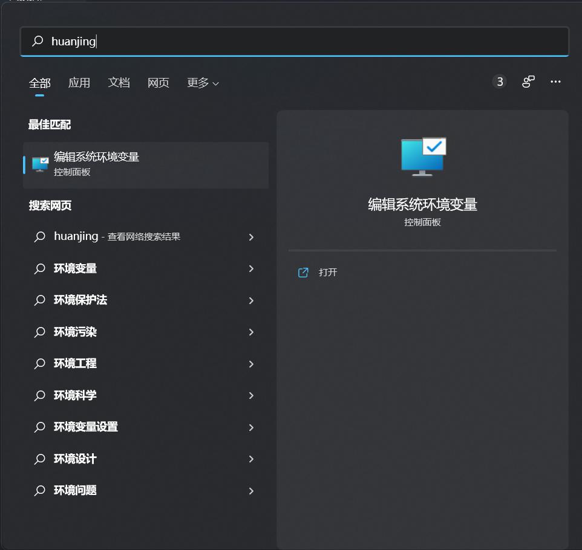
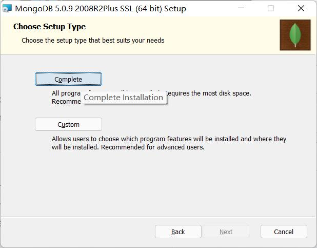
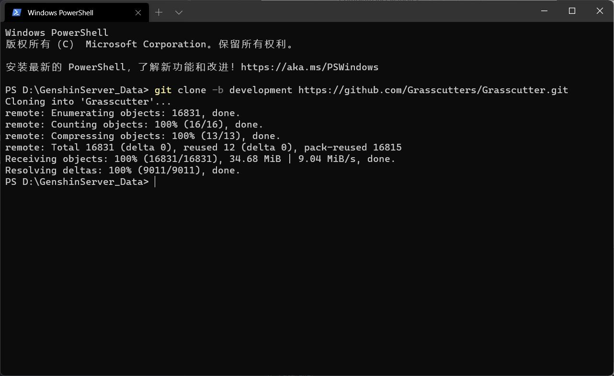
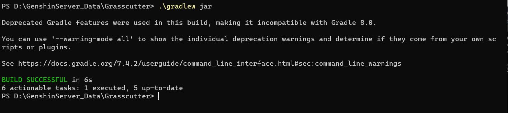
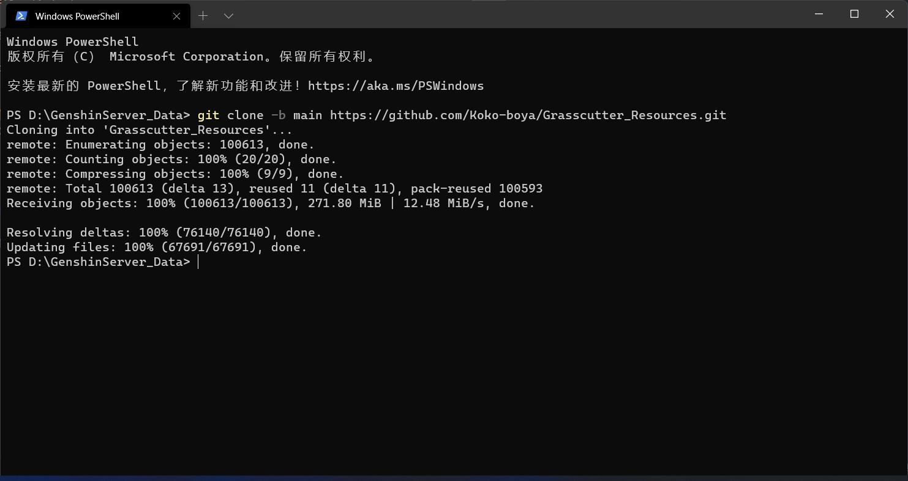
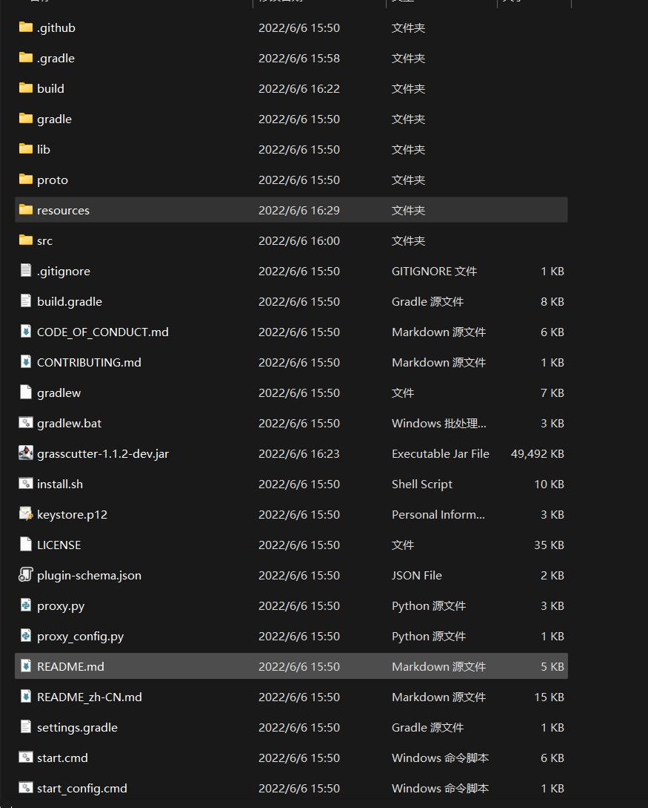
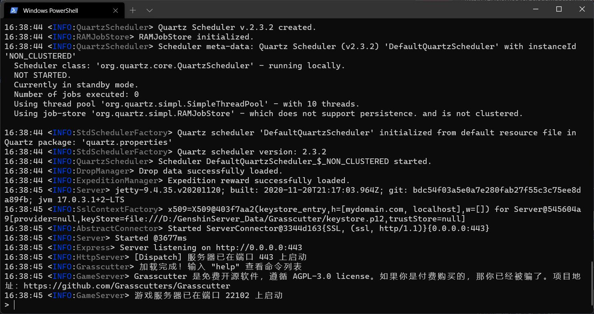
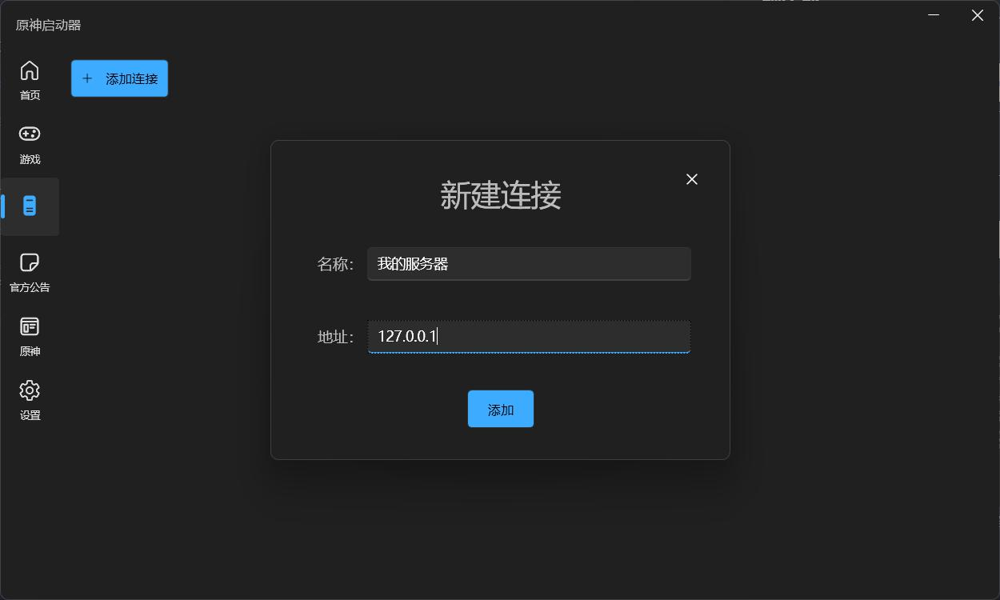
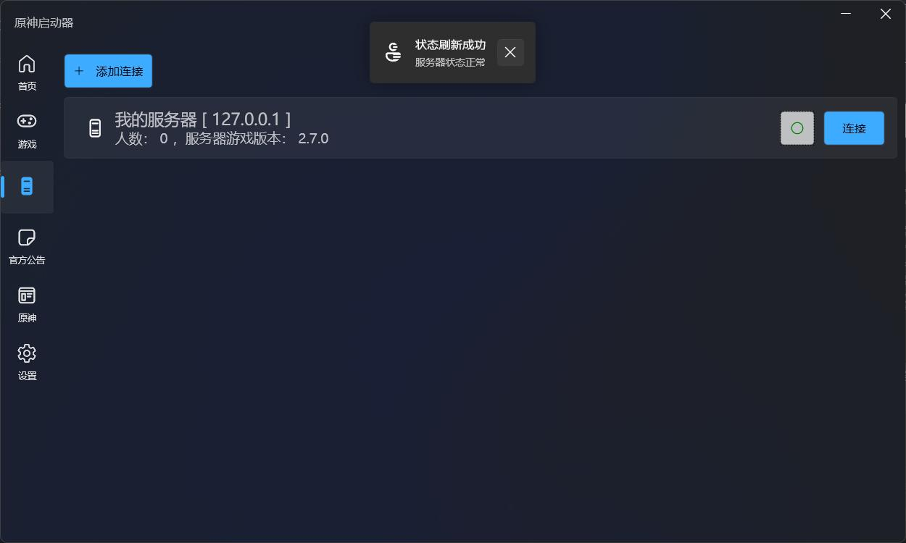

# Grasscutter服务器打包及连接


## 环境需求

1.[Java 17]("https://bell-sw.com/pages/downloads/#mn")
<br/>
2.[MongoDB]("https://www.mongodb.com/try/download/community?tck=docs_server")
<br/>
3.[Git]("https://pc.qq.com/detail/13/detail_22693.html")
<br/>
4.Windows操作系统，测试机为Win11

### 设置Java17
用来自编译最新的Grasscutter服务器本体
[](https://download.oracle.com/java/17/archive/jdk-17.0.1_windows-x64_bin.exe)
<br/>.\gradlew jar
[下载](https://bell-sw.com/pages/downloads/#mn)
<br/>

点击下载按钮后，选择 **Jdk17** ，根据需要进行选择下载
<br/>
然后无脑下一步进行安装(但是要记住Java17的安装位置，这个后面要考)
默认安装位置为：C:\Program Files\BellSoft\LibericaJDK-17
<br/>
我们需要进入上述路径，选择bin文件夹。
<br/>
到了这里，我们在Powershell中输入Java来获取Java是否安装成功，如果出现的字符串为灰白色则表明安装成功，如果出现红色报错字体则失败。成功后可以去看下一个标题了。
<br/>
在windows开始菜单搜索“环境”拼音，就会出现环境变量的搜索结果。
<br/>


按照：
<br/>
系统属性---高级---环境变量
<br/>
系统变量---新建系统变量
<br/>
变量名为：Java_Path
变量值为上述Java17的安装位置，后尾随一个bin（C:\Program Files\BellSoft\LibericaJDK-17\bin）
<br/>
此刻进行powershell，输入java如果还出现红色字体，则重启计算机重新尝试！

### 设置数据库（MongoDB）
此数据库为Grasscutter的存储数据库，包含以后的账号信息等。
<br/>
[进入网页](https://www.mongodb.com/try/download/community?tck=docs_server)
<br/>
找到页面上绿色的Download直接下载即可，如果有其他需要请自己筛选。
<br/>
安装时无脑下一步即可，唯一注意的是你修改的安装路径并不需要设置环境变量，所以安装路径可以随便。
例如出现下图的界面，选择他默认的**Complete**即可。
<br/>

### Git命令行
用来Clone克隆最新的Grasscutter代码，进行自编译。
<br/>
[下载，这里使用腾讯软件市场下载，记住一定要点击普通下载]("https://pc.qq.com/detail/13/detail_22693.html")
git官网下载比较繁琐且网络不好根本下载不了，这里更改下载源。
<br/>
Git命令行一直无脑下一步即可，无需任何更改。

## 克隆代码，并编译服务器运行件
命令行概述：即使用键盘输入命令来操作计算机。

此例子使用终端，即Windows新一代命令行工具。

我们在D盘之下新建一个GenshinServer_Data文件夹。

随后使用终端，并跳转到该文件夹之下。
输入如下命令
``` powershell
git clone -b development https://github.com/Grasscutters/Grasscutter.git
```
此命令意为，调用git工具，进行克隆（clone）代码，指定分支为（development），后追加github地址即可。
<br/>

<br/>
执行结果为上图。

此时回到文件夹中会发现多了一个Grasscutter文件夹，这个就是割草机目前最新的源代码。
<br/>

不退出命令行，再次输入cd Grasscutter，跳转到服务器文件夹之下。

输入如下编译命令，等待编译完成

``` powershell
.\gradlew jar
```
<br/>
编译时间较长，耐心等待，如果出现发行版本错误请自行百度，我不是写Java的人，也不清楚这种情况该怎么办。
<br/>



<br/>
当命令行中出现BUILD SUCCESSFUL绿色的字之后，编译成功。
<br/>
随后在Grasscutter文件夹中寻找一个jar文件，以现版本的名字叫做：grasscutter-1.1.2-dev.jar
	

## 克隆资源文件
接下来需要使用Git命令克隆配套的Resources文件夹，其中包含了人物数据，圣遗物，大世界脚本。
<br/>
在D盘的GenshinServer_Data文件夹中重新打开终端进行克隆
<br/>
命令如下
<br/>
``` powershell
git clone -b main https://github.com/Koko-boya/Grasscutter_Resources.git
```
<br/>


<br/>
克隆完毕后会多出一个Grasscutter_Resources文件夹，把其中的Resources文件夹直接剪切到服务器（Grasscutter）文件夹中
。
<br/>
**Windows文件夹是不区分大小写的，所以说如果要部署到别的服务器比如说Linux就需要更改为全小写**
<br/>
随后你的Grasscutter文件夹就有以下文件


## 预生成
在Grasscutter文件夹之下，终端中输入：
``` powershell
java -jar grasscutter-1.1.2-dev.jar -handbook
```
此后会有两次选择语言的机会，输入chs即可（中文简体）
等待生成完毕。

## 启动服务器
在Grasscttuer文件夹之下，终端中输入：
``` powershell
java -jar grasscutter-1.1.1.2-dev.jar
```
等待出现服务器启动成功即可

<br/>
切换到我的启动器，在服务器中创建一个连接，地址填上127.0.0.1即可，名称起一个好记的就可以。


<br/>
点击绿色的按钮，检查本地服务器状态



## 创建用户
``` C#
account create 用户名 UID
```

# 结束，原神私服搭建到此结束，如果想要更新Grasscutter就关注[官方](https://github.com/Grasscutters/Grasscutter)的开发进度